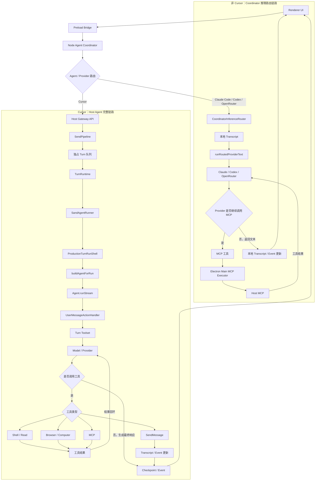

# Agent 核心关键流程

本文档概括 `grok-bot-0.18-reconstructed` 中 Agent 的两条主要执行路径：

- Cursor 请求经过 Electron Host 的完整 Agent 运行时。
- Claude Code、Codex、OpenRouter 请求由 Coordinator 侧的推理路由器直接驱动。



## 关键职责

- `Coordinator` 接收 Renderer 请求，并根据 Agent 或 Provider 类型选择执行路径。
- Cursor 路径通过 `Host Gateway API` 把用户回合交给独占队列，再由 `TurnRuntime` 启动完整 Agent 运行时。
- `buildAgentForRun` 组装模型、提示词、工具集和运行时依赖，`Agent.runStream` 驱动模型与工具的循环。
- 常规工具执行后将结果回送模型；`SendMessage` 则直接产生 Transcript/Event 更新。
- 非 Cursor 路径在 Coordinator 维护本地 Transcript，Provider 需要 MCP 时经 Electron Main 转发到 Host MCP，再把结果交回 Provider。

## 代码入口

- `source/node-agent-coordinator/main.ts:213`
- `source/node-agent-coordinator/inference-router.ts:121`
- `source/host/host-gateway-api.ts:184`
- `source/host/extensions/transcript/send-pipeline.ts:100`
- `source/host/extensions/transcript/send-turn-dispatch.ts:122`
- `source/host/extensions/transcript/turn-runtime.ts:327`
- `source/host/runner/sand-agent-runner.ts:1177`
- `source/host/runner/turn-agent-composition.ts:744`
- `source/host/runner/tools/turn-toolset.ts:1293`
- `source/host/extensions/inference/provider-session.ts:271`

## 逐文件详细流程图

以下图按源码中的核心函数拆开，重点标出输入校验、异步边界、条件分支、工具调用回环和清理动作。

### 1. `source/node-agent-coordinator/main.ts`

核心入口是 `composeCoordinator`：它先接管 Electron carrier，再同时维护 Renderer RPC、Main RPC、Host Gateway SSE 和本地执行守护进程。

```mermaid
flowchart TD
    M1([composeCoordinator]) --> M2[adoptCarrier]
    M2 --> M3{carrier adopted?}
    M3 -->|否| M4[写入 stderr 并 exit 2]
    M3 -->|是| M5[读取 bootstrap 与 carrier 通道]
    M5 --> M6[创建 controlClient 与传输记录器]
    M6 --> M7[创建 DNS 诊断与 HostSupervisor]
    M7 --> M8[创建 toolRelay 与事件处理器]
    M8 --> M9[创建 GatewayClient]
    M9 --> M10[创建 OAuthForwarder 与 LocalExecSupervisor]
    M10 --> M11{存在 WebAuthn signer?}
    M11 -->|是| M12[创建并启动 WebAuthn provider]
    M11 -->|否| M13[跳过 WebAuthn]
    M12 --> M14[创建 gatewayDispatch]
    M13 --> M14
    M14 --> M15[创建 CoordinatorInferenceRouter]
    M15 --> M16[dispatchRequest(method,args)]
    M16 --> M17{method 是 sendPrompt?}
    M17 -->|是| M18[记录 send trace 与 clientNonce]
    M17 -->|否| M19[跳过 send trace]
    M18 --> M20[inferenceRouter.dispatch]
    M19 --> M20
    M20 --> M21{本地 Router handled?}
    M21 -->|是| M22[返回本地路由结果]
    M21 -->|否| M23[转发 gatewayDispatch 到 Host]
    M22 --> M24[Renderer RPC 响应]
    M23 --> M24

    M8 --> M25[收到 Gateway SSE]
    M25 --> M26{事件 channel}
    M26 -->|mcp-oauth-pending| M27[通知 OAuth pending handlers]
    M26 -->|transcript| M28[记录用户 echo]
    M26 -->|client-side-tool-v2| M29[toolRelay.accept]
    M26 -->|agents / agent-upserted| M30[转发 agents-event 到 Main]
    M26 -->|其它已映射 family| M31[postEvent 到 Renderer]

    M9 --> M32[收到 transport event]
    M32 --> M33{transport-down?}
    M33 -->|是| M34[标记断线、清 health cache、通知 Renderer]
    M33 -->|否| M35[标记 connected、刷新 LocalExec、seed agents roster]
    M35 --> M36[通知 Renderer transport connected]

    M5 --> M37[绑定 control/data/main-data carrier frame]
    M37 --> M38[启动 LocalExecSupervisor 与 GatewayClient]
    M38 --> M39{任一 port settled / crash?}
    M39 -->|是| M40[关闭 Gateway、Relay、Supervisor、各 port]
    M40 --> M41[carrier.exitProcess(exitCode)]
```

### 2. `source/node-agent-coordinator/inference-router.ts`

该文件只接管非 Cursor Provider 的 `sendPrompt`，并为每个 `agentId` 建立串行队列；Transcript 同时落盘和推送 Renderer。

```mermaid
flowchart TD
    I1([createCoordinatorInferenceRouter]) --> I2[读取 settings 与 transcript store path]
    I2 --> I3[初始化 queues: Map<agentId, Promise>]
    I3 --> I4[dispatch(method,args)]
    I4 --> I5{reactToMessage?}
    I5 -->|是| I6[load 本地 store 并切换 my reaction]
    I6 --> I7{entry 存在且更新成功?}
    I7 -->|是| I8[persist + emit updated transcript]
    I8 --> I9[返回 handled]
    I7 -->|否| I10[继续其它路由判断]
    I5 -->|否| I10
    I10 --> I11{非 Cursor 且为 Transcript 查询?}
    I11 -->|是| I12[并行 dispatchRemote 与 load]
    I12 --> I13[合并远端 entries 与本地 entries]
    I13 --> I14[按 limit 截取并返回 handled]
    I11 -->|否| I15{method=sendPrompt 且 provider 非 Cursor?}
    I15 -->|否| I16[返回 handled=false，交给 Host Gateway]
    I15 -->|是| I17[按 agentId 取 previous queue]
    I17 --> I18[previous.catch 后串行 execute]
    I18 --> I19[finally 清理 queues 中的当前 Promise]
    I19 --> I20[立即返回 accepted=true]

    I18 --> I21[execute(provider,args)]
    I21 --> I22{agentId 与 prompt 有效?}
    I22 -->|否| I23[抛出参数错误]
    I22 -->|是| I24[并行读取远端 tail 与本地 store]
    I24 --> I25[计算 remoteTurn/localTurn 最大值]
    I25 --> I26[生成 tN u 用户 entry]
    I26 --> I27[原子 persist 并 emit appended]
    I27 --> I28[beginActivity：发布 isRunning 并每 250ms pulse]
    I28 --> I29[等待 1.2 秒稳定 composing UI]
    I29 --> I30[构造 ProviderMessage 与 tN s0 assistant id]
    I30 --> I31{provider=claude-code?}
    I31 -->|是| I32[创建 Routed MCP HTTP bridge]
    I31 -->|否| I33[listRoutedMcpTools 并准备 direct tools]
    I32 --> I34[runRoutedProviderText + onTextDelta]
    I33 --> I34
    I34 --> I35[每个 text delta emit appended/updated transcript]
    I35 --> I36{Provider 触发 MCP?}
    I36 -->|是| I37[dispatchRemote executeRoutedMcpTool]
    I37 --> I34
    I36 -->|否，stream 结束| I38[finally endActivity 并关闭 bridge]
    I38 --> I39[persist assistant entry 并 emit 最终 updated]
    I39 --> I40[返回 accepted]
    I18 -->|异常| I41[append Router error assistant entry]
    I41 --> I42[emit appended 并结束队列]
```

### 3. `source/host/host-gateway-api.ts`

`createHostGatewayApi` 是 Coordinator 到 Host 扩展的适配层。大多数方法只做参数整理、权限/遥测处理，然后委托给 Transcript、MCP 或其它扩展。

```mermaid
flowchart TD
    G1([createHostGatewayApi]) --> G2[获取 transcript、MCP、telemetry 等扩展 API]
    G2 --> G3[返回 Gateway method table]
    G3 --> G4{收到 method(args)}
    G4 -->|Transcript 查询| G5[校验 id / window 请求]
    G5 --> G6[manager.getAgentTranscript*]
    G4 -->|sendPrompt| G7[解析 agentId：显式值 > active agent > roster > unknown]
    G7 --> G8[telemetry.reportMessageSent]
    G8 --> G9[manager.sendPrompt(prompt, options)]
    G9 --> G10[返回 accepted=true]
    G4 -->|createAgent| G11{clientNonce 存在?}
    G11 -->|否| G12[mintAgent]
    G11 -->|是| G13{nonce 已有 pending Promise?}
    G13 -->|是| G14[复用 pending Promise]
    G13 -->|否| G15[创建 mint Promise 并写入 nonce ledger]
    G15 --> G16[超过容量时删除 oldest nonce]
    G12 --> G17[manager.createAgent + markActive + trackEvent]
    G14 --> G10
    G16 --> G17
    G17 --> G10
    G4 -->|openAgent / switchAgent| G18[markActive(app_open) 与 experiment telemetry]
    G18 --> G19[调用 manager.open/switch]
    G19 --> G20[reportAgentOpen + kickstartIfPending]
    G20 --> G10
    G4 -->|listRoutedMcpTools| G21[mcp.listTools]
    G21 --> G22[投影 name/providerIdentifier/toolName/schema]
    G22 --> G10
    G4 -->|executeRoutedMcpTool| G23[mcp.createExecutor(agentId)]
    G23 --> G24[executor.execute(toolName,args,toolCallId)]
    G24 --> G10
    G4 -->|refreshMcp| G25{routedAction}
    G25 -->|list-tools| G21
    G25 -->|execute-tool| G23
    G25 -->|OAuth completion| G26[handleDesktopMcpAuthCompletion]
    G25 -->|其它| G27[mcp.management.restart]
    G4 -->|其它 Host method| G28[method(api,name) 校验并 bind]
    G28 --> G29[委托对应扩展并返回结果]
```

### 4. `source/host/extensions/transcript/send-pipeline.ts`

`SendPipeline` 负责把一次 UI 发送变成持久化 echo、ack obligation 和可执行 turn；它在进入 Agent 运行时前完成附件、线程、分组和幂等处理。

```mermaid
flowchart TD
    P1([sendPrompt(prompt, options)]) --> P2{有 clientNonce?}
    P2 -->|否| P3[直接 sendPromptOnce]
    P2 -->|是| P4{nonce 在 inFlightSends?}
    P4 -->|是| P5[复用原 Promise，coalesce duplicate]
    P4 -->|否| P6[计算 inputDigest 并 acceptanceLedger.admitSend]
    P6 --> P7{已有 accepted duplicate?}
    P7 -->|是| P8[幂等 no-op]
    P7 -->|否| P9[启动 sendPromptOnce 并登记 inFlight]
    P9 --> P10{sendPromptOnce 成功?}
    P10 -->|否| P11[clearUnlessAccepted 并重新抛错]
    P10 -->|是| P12[finally 删除 inFlight nonce]
    P3 --> P13[sendPromptOnce]
    P9 --> P13
    P13 --> P14[trim prompt、过滤 attachment paths]
    P14 --> P15{prompt 与附件都为空?}
    P15 -->|是| P16[直接返回]
    P15 -->|否| P17{execution.canExecute?}
    P17 -->|否| P18[抛出 RUNNER_UNATTACHED_MESSAGE]
    P17 -->|是| P19[beginSendTrace 并记录 host receipt]
    P19 --> P20[ensureActionTarget 或 ensureSession]
    P20 --> P21[解析 targetAgentId 并 pin session]
    P21 --> P22[读取 transcript、确定屏幕状态与 reply threading]
    P22 --> P23[计算 roster side effects 与 attachment batch]
    P23 --> P24[stat file sizes]
    P24 --> P25[逐个创建 attachment echo]
    P25 --> P26{appendUserMessage 且 prompt 非空?}
    P26 -->|是| P27[创建 user message echo]
    P26 -->|否| P28[跳过 user message echo]
    P27 --> P29[持久化 entries 并记录 durable outcome]
    P28 --> P29
    P29 --> P30{echo 构建/持久化失败?}
    P30 -->|是| P31[删除已写 entries 与内存 entries 后抛错]
    P30 -->|否| P32[record pending acceptance 与 ack obligation]
    P32 --> P33[emitAcceptedSendEchoes + roster update]
    P33 --> P34[按 channel 拆分 image/video/file]
    P34 --> P35{remote room 或 group session?}
    P35 -->|是| P36[dispatchMirrorOrGroupSend]
    P35 -->|否| P37[dispatchUserTurn]
    P36 --> P38[返回并进入 finally]
    P37 --> P38
    P38 --> P39[dispose ackGuard、endSessionRun、结束 trace]
    P39 --> P40[markSendAccepted / nextTurnEpoch 等状态可供后续 turn 使用]
```

### 5. `source/host/extensions/transcript/send-turn-dispatch.ts`

`dispatchUserTurn` 是发送确认和 Agent 执行之间的窄桥：它不直接运行模型，而是准备 prompt、处理抢占，再把 turn 放入独占队列。

```mermaid
flowchart TD
    D1([dispatchUserTurn(args)]) --> D2[runnerRegistry.getRunner(session)]
    D2 --> D3{有 userMessageId?}
    D3 -->|是| D4[读取 addressed transcript 中最近用户消息]
    D3 -->|否| D5[recentUserMessages=undefined]
    D4 --> D6[展开 workflow references 与 mentioned agents]
    D5 --> D6
    D6 --> D7[拼接 composed offline note]
    D7 --> D8[nextTurnEpoch]
    D8 --> D9{可携带 recovery?}
    D9 -->|是| D10[记录 latestRecoverySends]
    D9 -->|否| D11[记录 recoveryBreakEpoch]
    D10 --> D12[beginSessionRun]
    D11 --> D12
    D12 --> D13[中断 active group member runner]
    D13 --> D14[中断 active one-to-one runner]
    D14 --> D15[记录 preemption、telemetry 与 ack interrupt]
    D15 --> D16[mintAckRunToken]
    D16 --> D17[enqueueExclusiveRun(session.id)]
    D17 --> D18[队列获得执行权]
    D18 --> D19[turnRuntime.runTurn(session, runner, promptForRun, options, epoch)]
    D19 --> D20[ackGuard.disarm]
    D20 --> D21[markSendAccepted(clientNonce)]
    D21 --> D22{awaitTurn?}
    D22 -->|是| D23[等待 turnDone 完成]
    D22 -->|否| D24[后台等待并捕获 detached turn error]
    D23 --> D25[返回 SendPipeline]
    D24 --> D25
```

### 6. `source/host/extensions/transcript/turn-runtime.ts`

`TurnRuntime` 管理一次用户回合的生命周期、空投递补偿、运行状态清理，并把 Runner 产生的更新转换成 Transcript/roster/telemetry 事件。

```mermaid
flowchart TD
    T1([runTurn(session, runner, prompt, options, epoch)]) --> T2[创建 turn trace 与 queue-wait span]
    T2 --> T3{epoch 过期且带 messageId?}
    T3 -->|否| T8[设置 active prompt/thread/fork/epoch]
    T3 -->|是| T4[读取 latestRecoverySends 与 recent messages]
    T4 --> T5{满足无附件、非 fork、可 prepend recovery?}
    T5 -->|是| T6[标记 superseded/cancelled，退休 ack token，结束 session run]
    T5 -->|否| T8
    T8 --> T9[startTurn telemetry + activeTurns]
    T9 --> T10[收集 unanswered widget prompts]
    T10 --> T11[runner.run(prompt, options + traceCtx + appendReplyReminder)]
    T11 --> T12{quiescedForUpgrade?}
    T12 -->|是| T13[markAgentResumePending]
    T12 -->|否| T14{未 aborted 且仍是当前 epoch?}
    T14 -->|否| T18[完成 turn finalize]
    T14 -->|是| T15[ensureUserReply]
    T15 --> T16{delivery owed 且仍未交付?}
    T16 -->|是| T17[reportTurnEmptyDelivery]
    T16 -->|否| T18
    T17 --> T18
    T18 --> T19[finalize success/cancelled + set trace outcome]
    T19 --> T20[emitAgentUpdate + emit automations]
    T20 --> T21[finally 清理 active maps、ack token、session run]
    T11 -->|异常| T22[classifyAgentError + mark trace error]
    T22 --> T23{仍是当前 epoch?}
    T23 -->|是| T24[写入 tray error]
    T23 -->|否| T25[不覆盖新回合错误状态]
    T24 --> T26[emitAgentUpdate]
    T25 --> T26
    T26 --> T21
    T6 --> T27[结束 trace 并 traceFlusher]
    T21 --> T27

    T15 --> U1[ensureUserReply]
    U1 --> U2{isDeliveryOwed 且 attempts < 3 且 epoch current?}
    U2 -->|是| U3[隐藏运行 REPLY_NUDGE_PROMPT]
    U3 --> U4{仍未交付?}
    U4 -->|是| U2
    U4 -->|否| U5[返回 settled result]
    U2 -->|否| U6{endedOnSilentToolCalls 且没有等待用户选择?}
    U6 -->|是| U7[运行 CLOSING_SEND_NUDGE_PROMPT]
    U6 -->|否| U5
    U7 --> U5

    A1([handleAgentUpdate(update)]) --> A2[确定 runSession 与 active-agent]
    A2 --> A3[更新 outline、composing、retrying、activity]
    A3 --> A4{update.type}
    A4 -->|tool-call pending/failed| A5[记录 tool start/error/stall telemetry，去重]
    A4 -->|request-id| A6[更新 active turn 与 lastRequestId]
    A4 -->|turn-ended| A7[报告 turn usage]
    A4 -->|send-message| A8[校验 reply target、自动加 thread、生成 entry]
    A8 --> A9{active agent?}
    A9 -->|是| A10[appendSendMessageEntry + fulfill ack + roster update]
    A9 -->|否| A11[写入 session DB + fulfill ack + mark activity]
    A4 -->|react-to-message| A12[验证用户消息并应用 reaction]
    A4 -->|其它| A13[忽略或返回 undefined]
```

### 7. `source/host/runner/sand-agent-runner.ts`

`SandAgentRunner` 是运行时控制器：生产配置存在时转入 `ProductionTurnRunShell`，否则使用本文件的 `runStep` 循环；两条路径都通过 `emitUpdate` 向 Host 转发状态。

```mermaid
flowchart TD
    R1([new SandAgentRunner(options)]) --> R2[初始化 conversation state / blob store]
    R2 --> R3[创建 observation 与 toolCallIdentity]
    R3 --> R4[按 ctx + box 创建 computerUse coordination]
    R4 --> R5[创建 subagent runtime]
    R5 --> R6{productionTurnRunShell options?}
    R6 -->|是| R7[创建 ProductionTurnRunShell adapter]
    R6 -->|否| R8[保留 fallback runStep path]
    R7 --> R9{ctx + box 可用?}
    R8 --> R9
    R9 -->|是| R10[创建 BackgroundWatches 与 shell terminal watch host]
    R9 -->|否| R11[不启用 background shell watches]

    R12([run(prompt, runOptions)]) --> R13{prompt / attachments 全为空?}
    R13 -->|是| R14[抛出 Prompt cannot be empty]
    R13 -->|否| R15{quiescingForUpgrade?}
    R15 -->|是| R16[返回 quiescedForUpgrade=true]
    R15 -->|否| R17{有 ProductionTurnRunShell?}
    R17 -->|是| R18[委托 productionTurnRunShell.run]
    R17 -->|否| R19[创建 requestId、AbortController、ActiveRun]
    R19 --> R20[emit lifecycle started + observation.turnStarted]
    R20 --> R21[prepare]
    R21 --> R22{prepare 后已 abort?}
    R22 -->|是| R23[返回 aborted result]
    R22 -->|否| R24[标记 dispatched]
    R24 --> R25{runStep 已绑定?}
    R25 -->|否| R26[返回 undefined]
    R25 -->|是| R27[按 maxSteps 循环 runStep]
    R27 --> R28{stepResult.done?}
    R28 -->|否| R27
    R28 -->|是| R29[settle(result)]
    R29 --> R30{有 text / send-message / reaction?}
    R30 -->|是| R31[组装 SandAgentRunnerResult]
    R30 -->|否| R32[返回 runStep result]
    R31 --> R33[finally emit lifecycle ended]
    R32 --> R33
    R18 --> R34[统一返回 production result]
    R23 --> R33
    R26 --> R33
    R33 --> R35[清理 active run、first-token timer、request source]

    R36([emitUpdate(update)]) --> R37{首次 text/thinking/tool 输出?}
    R37 -->|是| R38[标记 streamOutputProduced 并清除首 token deadline]
    R37 -->|否| R39[保持输出状态]
    R38 --> R40{update.send-message?}
    R39 --> R40
    R40 -->|是| R41[增加 sentMessageCount；widget/secret/approval 设置 awaiting selection]
    R40 -->|否| R42[不改 message 计数]
    R41 --> R43[transport.onUpdate]
    R42 --> R43
    R43 --> R44{reaction 已由 transport 应用?}
    R44 -->|是| R45[标记 reacted]
    R44 -->|否| R46[结束 update]

    R47([interrupt / requestQuiesceForUpgrade]) --> R48{Production shell 存在?}
    R48 -->|是| R49[转发 interrupt 或 quiesce]
    R48 -->|否| R50[abort active controller / 设置 quiesce 标志]
    R49 --> R51[取消 background watches 与 auto-review]
    R50 --> R51
```

### 8. `source/host/runner/turn-agent-composition.ts`

该文件把每回合的模型、提示词、工具、资源、摘要处理器和真实 `AnysphereAgent` 组装起来，并提供不可变 checkpoint 到 `Agent.runStream` 的边界。

```mermaid
flowchart TD
    C1([buildAgentForRun(input)]) --> C2[createSandTurnModelProjection(modelId)]
    C2 --> C3[把 parentModelInfo / subagentModels 注入 turn]
    C3 --> C4[createTurnAgentToolsHandoff]
    C4 --> C5{有 per-turn provider 或直接依赖?}
    C5 -->|否| C6[复用 toolHost，不合成缺省工具]
    C5 -->|是| C7[按 turn props 投影 computer/browser/MCP/shell factories]
    C7 --> C8[createTurnToolsetFactoriesForTurn]
    C8 --> C9[返回 lazy toolsGenerator 与 activeStateHandler]
    C6 --> C9
    C9 --> C10[createSandAgentStaticConfig + profile snapshot hooks]
    C10 --> C11[createTurnAgentForRun]
    C11 --> C12[创建 ForwardingInteractionListener 并应用 privacy mode]
    C12 --> C13[创建 summarization handler]
    C13 --> C14[new AnysphereAgent(config, toolSession, listener, resource, blob, summary)]
    C14 --> C15[返回 agent、config、toolsGenerator、runStream]
    C15 --> C16[runStream(streamInput)]
    C16 --> C17[agent.runStream(attemptCtx,state,action,mcpTools,persistCheckpoint)]

    H1([toolsGenerator(props)]) --> H2[合并 turnScope hooks 与 parent/subagent model]
    H2 --> H3[解析 per-turn shell auto-review]
    H3 --> H4[捕获 stateHandler]
    H4 --> H5[buildTurnTools(projectedHost, turn, props)]
    H5 --> H6[返回本回合 ToolSet]

    S1([createTurnAgentStreamStart]) --> S2[createTurnAgentRunStreamInput]
    S2 --> S3[createTurnRedactedRunProjection]
    S3 --> S4[复制/投影 state 与 action，保留 mcpTools identity]
    S4 --> S5[原样转发 persistCheckpoint callback]
    S5 --> C17

    P1([createTurnAgentRunInputProjection]) --> P2[createAction(runCtx)]
    P2 --> P3{注入 MCP provider?}
    P3 -->|是| P4[getTools；失败则记录 discovery failure]
    P4 --> P5[refreshAccountConfig]
    P3 -->|否| P6[使用空 MCP 列表]
    P5 --> P7[复制 ConversationStateStructure]
    P6 --> P7
    P7 --> P8[返回 action、baseState、mcpTools]
```

### 9. `source/host/runner/tools/turn-toolset.ts`

`buildTurnTools` 是工具面生成器。它根据 runner 类型、远程 Box、动态工具、共享房间和 per-turn MCP 状态决定哪些工具真正暴露给模型。

```mermaid
flowchart TD
    F1([createTurnToolsetFactoriesForTurn]) --> F2[调用 provider 的各 create*Inputs(turn, props)]
    F2 --> F3[createTurnToolsetFactories]
    F3 --> F4[得到 task/multitask/shell/read/browser/MCP/SendMessage 等 lazy factories]
    F4 --> F5[buildTurnTools(host, turn, props)]
    F5 --> F6{subagent 且非 computer/browser 且无 subagentConfigs?}
    F6 -->|是| F7[返回空 fencedToolSet]
    F6 -->|否| F8[计算 dynamicToolsEnabled]
    F8 --> F9{dynamic tools 开启?}
    F9 -->|是| F10[创建 DynamicToolRegistry 与 invocation resolver]
    F9 -->|否| F11[不创建动态注册表]
    F10 --> F12[开始累积 tools]
    F11 --> F12
    F12 --> F13{主 Agent 且有 subagentConfigs?}
    F13 -->|是| F14[加入 Task tool]
    F13 -->|否| F15[跳过 Task]
    F14 --> F16{multitask enabled 且非 system prompt override?}
    F15 --> F16
    F16 -->|是| F17[加入 Multitask TodoWrite]
    F16 -->|否| F18[跳过 Multitask]
    F17 --> F19[加入 SendMessage、SendToAgent、Reaction、Agent/State 管理工具]
    F18 --> F19
    F19 --> F20{非 Box-scoped?}
    F20 -->|是| F21[加入 host Shell/Read/Await、Web Search/Fetch]
    F20 -->|否| F22[跳过 host 工具]
    F21 --> F23{remote Box available?}
    F22 --> F23
    F23 -->|是| F24[加入 box Shell/Read/Await 与 FileTransfer]
    F23 -->|否| F25[跳过 Box 工具]
    F24 --> F26{computer/browser/screenshot 条件满足?}
    F25 --> F26
    F26 -->|computer subagent| F27[加入 Computer]
    F26 -->|browser subagent| F28[加入 Browser]
    F26 -->|主 Agent + desktop| F29[加入 Screenshot 与 BoxHelp]
    F27 --> F30{有 per-turn MCP 或 dynamic registry?}
    F28 --> F30
    F29 --> F30
    F30 -->|是| F31[把 MCP descriptors 分组并创建 GetMcpTools + CallMcpTool]
    F30 -->|否| F32[不暴露 MCP discovery/call pair]
    F31 --> F33[主 Agent 可加入 MCP management 与 subagent management]
    F32 --> F33
    F33 --> F34{shared room?}
    F34 -->|是| F35[按 SHARED_ROOM_TOOL_NAMES 过滤]
    F34 -->|否| F36[保留全部候选工具]
    F35 --> F37[动态 placement 或保持 static]
    F36 --> F37
    F37 --> F38[每个工具套 local permission 与 record tool name]
    F38 --> F39[套 execution timeout / dynamic invocation timeout]
    F39 --> F40[fencedToolSet(guarded, spotlight, registry)]
    F40 --> F41[返回模型可见 ToolSet]

    M1([createTurnMcpMetaToolFactory]) --> M2[读取 per-turn MCP descriptors]
    M2 --> M3[按 providerIdentifier 分组并排序 toolName]
    M3 --> M4[创建 discovery tool 与 call tool]
    M4 --> M5[返回 MCP 工具对]

    X1([模型调用工具]) --> X2[withLocalToolScope 检查权限]
    X2 --> X3{权限允许?}
    X3 -->|否| X4[等待/返回 permission result]
    X3 -->|是| X5[记录 tool name 并执行原始 tool]
    X5 --> X6{超时?}
    X6 -->|是| X7[返回 tool timeout error]
    X6 -->|否| X8[返回工具结果给模型]
```

### 10. `source/host/extensions/inference/provider-session.ts`

该文件统一三个非 Cursor Provider 的流式接口。上层只消费 `fullStream`，Provider-specific credential、MCP 工具格式和 usage 记录都在这里收敛。

```mermaid
flowchart TD
    V1([runRoutedProviderText(provider,messages,options)]) --> V2[创建 invocationId 与 usage recorder]
    V2 --> V3{provider}
    V3 -->|codex| V4[codexExecutor]
    V3 -->|claude-code| V5[claudeExecutor]
    V3 -->|openrouter| V6[openRouterExecutor]

    V4 --> C1[读取并校验 CODEX_HOME/auth.json 权限与 ChatGPT tokens]
    C1 --> C2[读取 model 与 reasoning effort]
    C2 --> C3[将 definitions 转为 CodexDirectTool]
    C3 --> C4[创建带 Bearer + account id 的 authenticated fetch]
    C4 --> C5[streamCodexDirectResponses，tools 时 maxSteps=8]
    C5 --> C6{HTTP 401?}
    C6 -->|是| C7[用 refresh_token 刷新并原子写回 auth.json]
    C7 --> C5
    C6 -->|否| C8[产生 text-delta 与 usage/response metadata]

    V5 --> A1[resolveClaudeCodeCliPath]
    A1 --> A2{CLI 存在?}
    A2 -->|否| A3[抛出未安装错误]
    A2 -->|是| A4{有 mcpServerUrl?}
    A4 -->|是| A5[配置 grok_bot_plugins HTTP MCP 与 maxTurns=8]
    A4 -->|否| A6[无工具，maxTurns=1]
    A5 --> A7[queryClaude(providerPrompt(messages))]
    A6 --> A7
    A7 --> A8{result subtype success?}
    A8 -->|否| A9[抛出 Claude result error]
    A8 -->|是| A10[产生文本、usage、session metadata]

    V6 --> O1[读取 OPENROUTER_API_KEY 或 persisted secret]
    O1 --> O2[创建 OpenAI-compatible model]
    O2 --> O3[将 definitions 转为 AI SDK ToolSet]
    O3 --> O4[streamText，tools 时 maxSteps=8]
    O4 --> O5[fullStream + response + usage]

    C8 --> V7[统一消费 fullStream]
    A10 --> V7
    O5 --> V7
    V7 --> V8{event=text-delta?}
    V8 -->|是| V9[累加 text 并回调 onTextDelta(delta, accumulated)]
    V9 --> V7
    V8 -->|否| V10[等待 result.response]
    V10 --> V11[recordRoutedUsage]
    V11 --> V12[返回完整文本给 inference-router]

    Q1([Provider 工具调用]) --> Q2{提供 executeTool?}
    Q2 -->|是| Q3[Codex/OpenRouter 执行 routed tool]
    Q2 -->|否| Q4[本次 Provider 不暴露执行器]
    Q3 --> Q5[工具结果回到 Provider 的 maxSteps loop]
    Q5 --> V7
```
