# Grok Bot 0.18 Reconstructed：核心代码与核心流程

本文面向第一次阅读该仓库的开发者，目标是回答四个问题：

1. 哪些目录和文件是真正需要优先阅读的核心代码；
2. Electron 桌面端、Coordinator、Host、执行守护进程之间如何协作；
3. Cursor 与 Claude Code、Codex、OpenRouter 为什么会走两条不同的推理链路；
4. 一条用户消息如何进入模型、调用工具、写入 Transcript 并回到界面。

> 仓库是 Grok Bot 0.18.0 已发布应用的非官方重构，不是原始 monorepo。默认发布包也是混合构建：大部分运行时代码来自 `source/`，但 Renderer、Electron Shell 和部分 ABI 依赖继续使用校验锁定的 0.18.0 发布物。

## 1. 一页结论

项目可以分成六条主干：

| 主干 | 主要职责 | 最重要入口 |
| --- | --- | --- |
| 桌面控制面 | 应用启动、窗口、账号、设置、密钥、进程生命周期 | `source/electron-main/main.ts` |
| Renderer 与可信桥 | UI、桌面 RPC、Coordinator MessagePort | `frontend/src/main.tsx`、`source/electron-preload/preload.ts` |
| Coordinator | Renderer RPC、Host Gateway、Provider 路由、本机执行监督 | `source/node-agent-coordinator/main.ts` |
| Host Agent 运行时 | Agent、Transcript、Turn、工具、MCP、状态持久化 | `source/host/main.ts`、`source/host/sand-host.ts` |
| 执行面 | Box 命令、本机命令、Browser、Computer、文件读写 | `source/box-exec-daemon/main.ts`、`source/local-exec-daemon/main.ts` |
| 重构与打包 | 固定上游输入、编译源码、覆盖运行时、签名与验证 | `scripts/bootstrap-runtime.mjs`、`scripts/package-macos.mjs` |

最关键的分流规则是：

- `cursor`：Renderer 请求经 Coordinator 转发到 Host，进入完整 Agent/Turn/Tool 运行时。
- `claude-code`、`codex`、`openrouter`：普通 `sendPrompt` 在 Coordinator 被截获，直接调用 Provider，并只桥接 routed MCP 工具。

因此，非 Cursor Provider 的普通对话不是“完整 Agent 运行时换了一个模型”，而是一条较短的本地路由链路。

## 2. 代码优先级分类

### 2.1 P0：读懂端到端流程必须阅读

| 分类 | 文件 | 核心职责 |
| --- | --- | --- |
| Electron 启动 | `source/electron-main/main.ts` | 单实例、窗口、安全参数、服务初始化和退出 |
| Main 服务组装 | `source/electron-main/main-production-services.ts` | 账号、设置、Coordinator、MCP、遥测等服务的生产组合 |
| Main RPC | `source/electron-main/main-edge.ts` | Renderer 可调用的设置、路由、Docker、模型、窗口接口 |
| Preload | `source/electron-preload/preload.ts` | 暴露 `window.desktop` 和 `window.coordinatorPort` |
| Renderer 入口 | `frontend/src/main.tsx` | 获取可信桥并挂载 React |
| Renderer 主壳 | `frontend/src/production/ProductionRenderer.tsx` | 账号、侧栏、对话、设置和各 Overlay 的总组合 |
| Coordinator 入口 | `source/node-agent-coordinator/main.ts` | 建立三条 MessagePort、Gateway、OAuth、WebAuthn、本机执行和路由器 |
| Provider 分流 | `source/node-agent-coordinator/inference-router.ts` | 截获非 Cursor 请求、本地 Transcript、流式响应与 MCP 转发 |
| Host 入口 | `source/host/main.ts` | Host 锁、Gateway、Box Exec daemon 和进程退出 |
| Host API | `source/host/host-gateway-api.ts` | 把 Gateway method 映射到 Agent、Transcript、MCP 等扩展 |
| 消息入口 | `source/host/extensions/transcript/send-pipeline.ts` | 用户 Echo、附件、幂等、Ack 和 Turn 派发 |
| Turn 生命周期 | `source/host/extensions/transcript/turn-runtime.ts` | Turn 状态、Runner 更新、Transcript 和错误收敛 |
| Agent Runner | `source/host/runner/sand-agent-runner.ts` | 单次 Agent 运行、流式更新、中断与清理 |
| Agent 组装 | `source/host/runner/turn-agent-composition.ts` | 模型、Prompt、状态、工具和 `Agent.runStream` |
| 工具集合 | `source/host/runner/tools/turn-toolset.ts` | 按 Agent 类型和能力生成最终 ToolSet |

### 2.2 P1：理解具体能力时阅读

| 能力 | 关键目录或文件 |
| --- | --- |
| Cursor 推理 | `source/host/extensions/inference/cursor-session.ts` |
| Claude/Codex/OpenRouter | `source/host/extensions/inference/provider-session.ts` |
| Codex Responses SSE | `source/host/extensions/inference/codex-direct-responses.ts` |
| Coordinator Gateway | `source/node-agent-coordinator/gateway/` |
| MCP 管理 | `source/electron-main/mcp/`、`source/host/extensions/mcp/` |
| Routed MCP 桥 | `source/node-agent-coordinator/routed-mcp-bridge.ts` |
| 远程或本地 Box | `source/electron-main/box/`、`source/host/box/` |
| Local Docker | `source/electron-main/box/local-docker-host-connector.ts` |
| 本机执行权限 | `source/shared/local-tool-permission*.ts` |
| 本机执行 daemon | `source/host/local-exec/`、`source/local-exec-daemon/` |
| Box 执行 daemon | `source/box-exec-daemon/` |
| Agent 数据库 | `source/host/extensions/session/agent-db.ts` |
| Transcript Mirror | `source/host/transcript-mirror/` |
| 账号和凭据 | `source/electron-main/account/`、`source/electron-main/secrets/` |
| Renderer 功能 | `frontend/src/recovered/features/` |

### 2.3 P2：支撑、协议与生成代码

| 分类 | 目录 | 阅读建议 |
| --- | --- | --- |
| 共享契约 | `source/shared/` | 遇到 RPC、设置、权限或 wire format 时按需阅读 |
| Agent 基础包 | `source/packages/agent*` | 追踪 `Agent.runStream`、工具执行和摘要时阅读 |
| Proto | `source/packages/proto/generated/` | 大量生成代码，不建议从这里开始 |
| Redacted Proto | `source/packages/redacted-protos/generated/` | 仅在隐私/序列化边界需要时阅读 |
| 重构清单 | `manifests/reconstruction/` | 验证来源、覆盖率和 runtime composition |
| 构建工具 | `scripts/` | 研究重构、打包和可复现性时阅读 |

## 3. 运行时进程拓扑

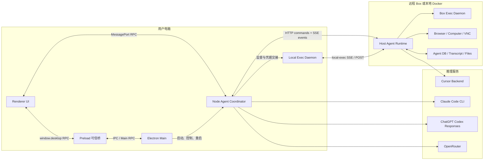

两个前端调用面需要区分：

- `window.desktop` 面向 Electron Main，处理账号、密钥、设置、窗口、更新、Docker 等桌面能力。
- `window.coordinatorPort` 面向 Coordinator，处理 Agent 列表、Transcript、发送消息和实时事件。

## 4. 应用启动与连接流程

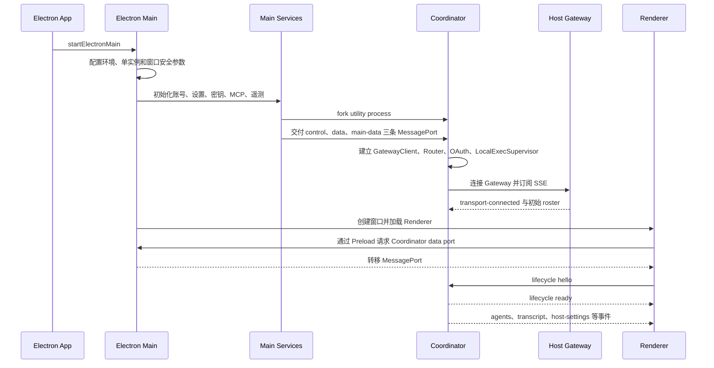

关键代码对应关系：

1. `source/electron-main/main.ts`：应用和窗口生命周期。
2. `source/electron-main/coordinator/coordinator-launcher.ts`：创建 utility process 和三条 MessagePort。
3. `source/electron-main/coordinator/coordinator-runtime.ts`：崩溃重启、端口转移和 generation 隔离。
4. `source/node-agent-coordinator/main.ts`：Coordinator 内部服务组合。
5. `frontend/src/production/coordinator-client.ts`：Renderer 侧协议、请求表和事件订阅。

## 5. 用户消息总分流

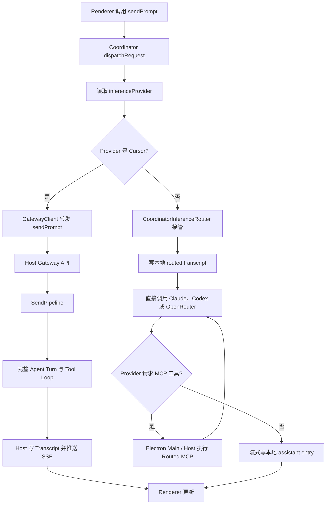

### 5.1 分流边界

`source/node-agent-coordinator/inference-router.ts` 的 `dispatch` 只在以下条件接管：

- 当前 Provider 不是 `cursor`；
- method 为 `sendPrompt`，或为需要合并本地路由记录的 Transcript 查询；
- 本地 reaction 命中了 routed transcript 中的消息。

其余请求继续交给 Host Gateway。

## 6. Cursor：完整 Agent 回合

### 6.1 主流程

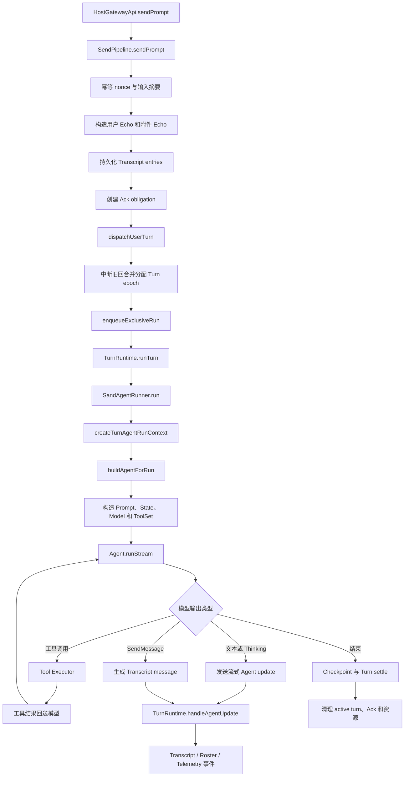

### 6.2 Agent 组装点

`source/host/runner/turn-agent-composition.ts` 是完整 Agent 路径最重要的组合边界。它负责：

- 选择主模型、子 Agent 模型和摘要模型；
- 组装 Agent profile、system prompt 和 conversation state；
- 创建 MCP、Shell、Browser、Computer、Task、SendMessage 等工具；
- 创建 `AnysphereAgent`；
- 将 checkpoint 持久化回调交给 `Agent.runStream`。

### 6.3 工具循环

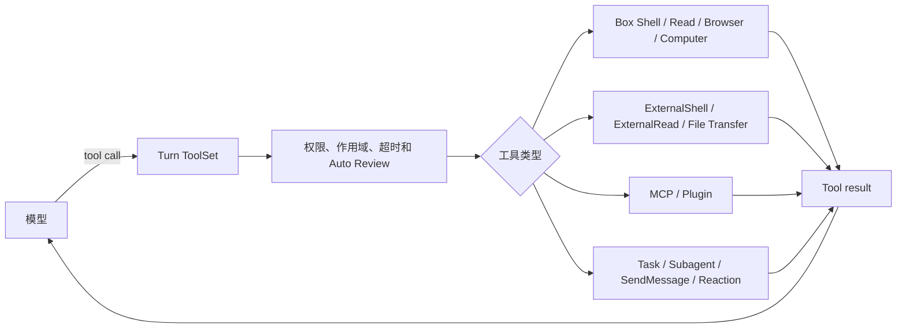

工具最终集合由 `source/host/runner/tools/turn-toolset.ts` 根据以下因素动态裁剪：

- 主 Agent、Computer 子 Agent、Browser 子 Agent或其他子 Agent；
- Box 是否可用；
- 本机执行权限是否允许；
- MCP 是否连接以及工具是否被禁用；
- Shared Room 对工具名的白名单；
- 动态工具和实验开关。

## 7. Claude Code、Codex、OpenRouter：本地路由回合

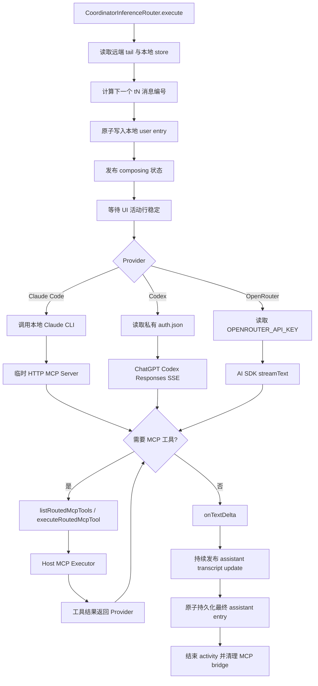

### 7.1 Provider 差异

| Provider | 认证来源 | 请求方式 | 工具方式 |
| --- | --- | --- | --- |
| Claude Code | 本地 Claude CLI 登录 | `@anthropic-ai/claude-agent-sdk` | 临时 loopback HTTP MCP Server |
| Codex | `~/.codex/auth.json` | ChatGPT Codex Responses SSE | Responses function tools |
| OpenRouter | `OPENROUTER_API_KEY` | OpenAI-compatible `streamText` | AI SDK tools |

### 7.2 Routed Transcript 规则

本地文件为 `inference-router-transcript.json`，按 `agentId` 保存：

- 每个 Agent 最多 200 条；
- 只保存 `user` 和 `assistant` 文本、rich text、reaction 和时间；
- 每个 Agent 使用 Promise queue 串行化；
- 写入采用临时文件加 rename；
- UI 查询时把 Host 远端 entries 和本地 entries 合并。

重要限制：Provider 请求的上下文只来自本地 routed transcript。Host 的 Cursor 历史用于计算 Turn 编号，但不会作为 Provider messages 发送。因此 Provider 切换后的 UI 历史与真实模型上下文并不完全相同。

## 8. MCP 与 Plugin 调用链

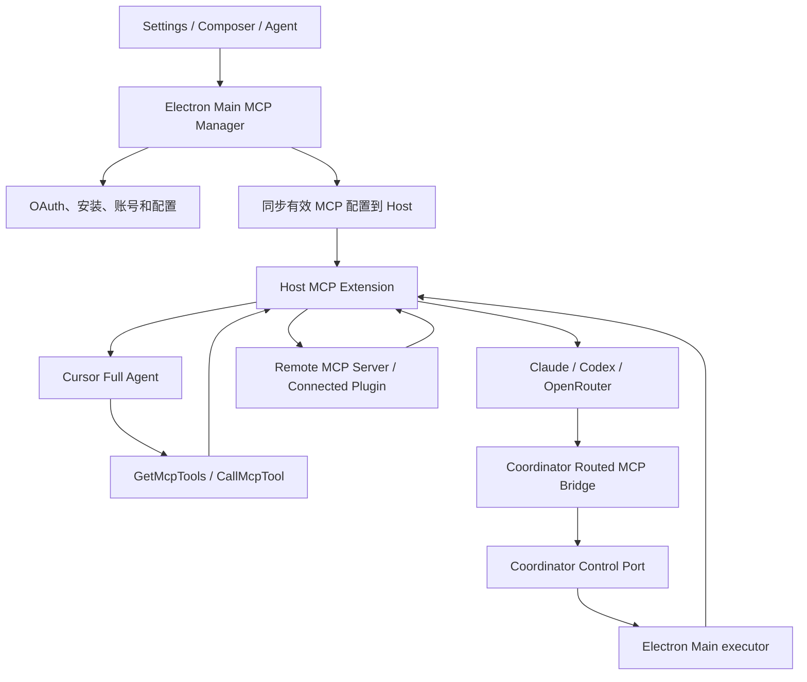

这里有两种 MCP 消费方式：

- 完整 Agent 路径把 MCP 包装成 Meta Tool，模型可先发现再调用。
- Routed Provider 路径把可用 MCP 工具投影成 Provider 原生 function tools，或通过临时 MCP HTTP bridge 暴露给 Claude Code。

## 9. 本机执行与 Box 执行

### 9.1 执行位置分类

| 工具面 | 实际执行位置 | 主要保护 |
| --- | --- | --- |
| `Shell`、`Read`、`Browser`、`Computer` | 远程 Box 或本地 Docker | Box 隔离、Gateway token、工作区路径限制 |
| `ExternalShell`、`ExternalRead`、文件传输 | 用户电脑 | `ask/always/never` 外层授权、approval ID、路径限制 |
| MCP 工具 | 对应 MCP Server | MCP 账号、工具禁用和 Provider 配置 |

### 9.2 本机执行授权链

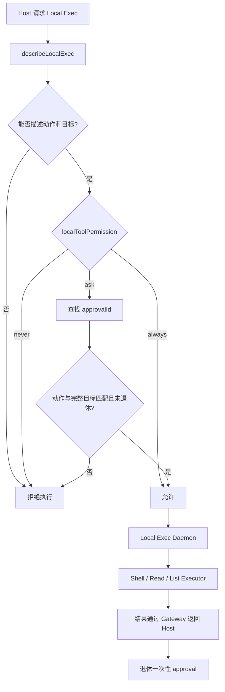

默认权限为 `ask`。本机执行 root 未显式配置时是用户 Home 目录。生产执行器内部使用允许型 permissions service；若上游没有给 Shell 指定 sandbox policy，默认策略为 `insecure_none`。因此本机安全主要依赖外层授权门，不应把 `always` 当作普通便利设置。

### 9.3 Box Exec daemon

`source/box-exec-daemon/server.ts` 提供 loopback Connect RPC：

- Bearer token 验证；
- 前台和后台 Shell；
- Read、Shell Stream、stdin；
- 工作区路径和符号链接逃逸检查；
- `/bin/sh -lc` 执行模型生成的命令。

## 10. 远程 Box 与本地 Docker

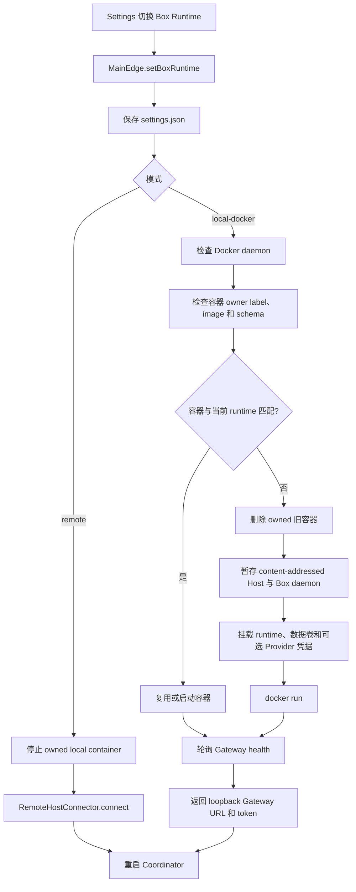

关键实现为 `source/electron-main/box/local-docker-host-connector.ts`。需要特别注意：

- 镜像使用 `sand-box-latest` 标签，不是 digest；
- `~/.codex` 和 `~/.claude` 会以只读方式挂载到容器；
- 端口只发布到 `127.0.0.1`；
- Host 和 Box Exec daemon 以内容哈希目录暂存并只读挂载；
- 工作区和 Host 数据使用 Docker volume 持久化。

## 11. 状态与持久化

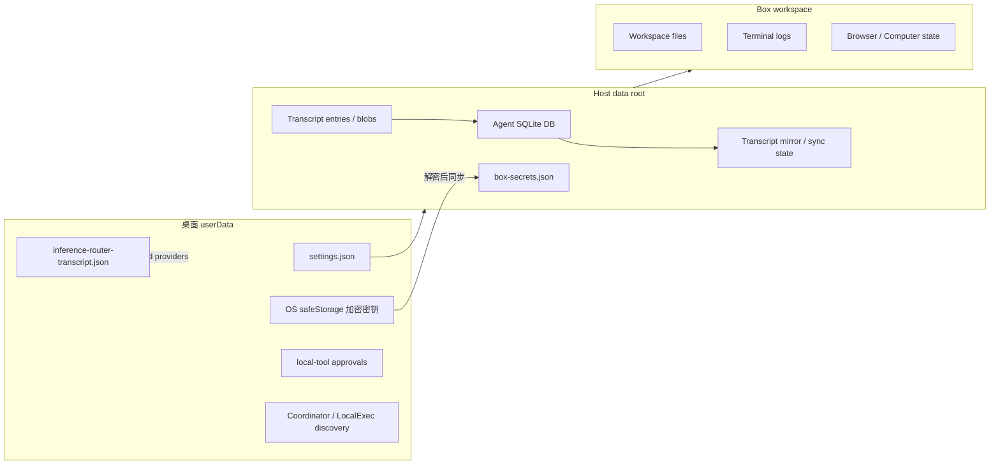

状态边界要点：

- Desktop 密钥使用 Electron `safeStorage` 加密；不可用时退化为仅内存。
- 密钥同步到 Host 后，以权限 `0600` 的 `box-secrets.json` 持久化，并注入 Box 环境变量。
- Cursor 完整路径的 Transcript 由 Host 数据库负责。
- 非 Cursor 普通请求另有 Coordinator 本地 Transcript。
- UI 会把两类 Transcript 合并展示，但两个模型上下文并没有自动合并。

## 12. 重构、构建与打包

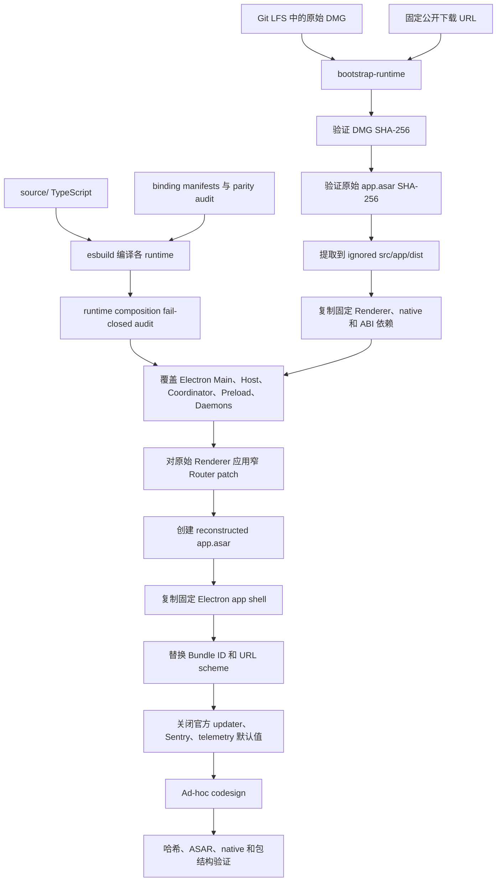

### 12.1 默认包与可编辑 Renderer

仓库同时存在两条 Renderer 路径：

- 默认 `npm run package`：使用 checksum-pinned 原版 Renderer，再应用窄 Router UI patch。
- `npm run frontend:build`：构建 `frontend/src/main.tsx` 对应的可编辑 React Renderer。

可编辑 Renderer 是研究和替换候选，但不是默认 macOS 包的 UI 权威来源。

## 13. 核心不变量与容易误读之处

1. **Renderer 有两套来源**：仓库内 React 源码可构建，但默认发布包使用固定原版 Renderer。
2. **Provider 有两条路径**：Cursor 是完整 Agent；其他 Provider 的普通消息由 Coordinator 直接执行。
3. **UI 历史不等于模型上下文**：远端 Cursor Transcript 与本地 routed transcript 只在展示层合并。
4. **本机工具不是 Box 工具**：`External*` 能访问用户电脑，默认 root 是 Home 目录。
5. **只读凭据挂载仍可被读取**：Local Docker 的只读 mount 只能阻止容器修改凭据，不能阻止读取。
6. **构建审计是 fail-closed**：生产 binding、artifact anchor 或哈希漂移会阻止 clean runtime 被接受。
7. **上游版本被固定**：代码针对 0.18.0 和 Electron 42.1.0，不保证兼容后续 Grok Bot 版本。

## 14. 推荐阅读顺序

### 路线 A：只想理解一次聊天如何执行

1. `source/node-agent-coordinator/main.ts`
2. `source/node-agent-coordinator/inference-router.ts`
3. `source/host/host-gateway-api.ts`
4. `source/host/extensions/transcript/send-pipeline.ts`
5. `source/host/extensions/transcript/send-turn-dispatch.ts`
6. `source/host/extensions/transcript/turn-runtime.ts`
7. `source/host/runner/sand-agent-runner.ts`
8. `source/host/runner/turn-agent-composition.ts`
9. `source/host/runner/tools/turn-toolset.ts`
10. `source/host/extensions/inference/provider-session.ts`

### 路线 B：理解 Electron 多进程与 RPC

1. `source/electron-main/main.ts`
2. `source/electron-main/main-production-services.ts`
3. `source/electron-main/coordinator/coordinator-launcher.ts`
4. `source/electron-preload/preload.ts`
5. `frontend/src/production/coordinator-client.ts`
6. `source/node-agent-coordinator/renderer-port-server.ts`
7. `source/node-agent-coordinator/gateway/gateway-client.ts`

### 路线 C：理解重构和可复现构建

1. `PROVENANCE.md`
2. `scripts/bootstrap-runtime.mjs`
3. `scripts/lib/clean-build.mjs`
4. `scripts/clean-build.mjs`
5. `scripts/host-production-activation.mjs`
6. `scripts/electron-main-production-activation.mjs`
7. `scripts/package-macos.mjs`
8. `scripts/lib/macos-package-verification.mjs`

## 15. 与详细 Agent 流程文档的关系

本文负责项目级分类、进程边界和主链路。若需要继续下钻到函数级条件分支、异步队列、Ack、Turn、ToolSet 和 Provider 循环，请阅读：

- `docs/AGENT_CORE_FLOW.md`

该文档包含 Coordinator、Inference Router、SendPipeline、TurnRuntime、SandAgentRunner、Agent 组装和工具集的逐文件 Mermaid 流程图。
